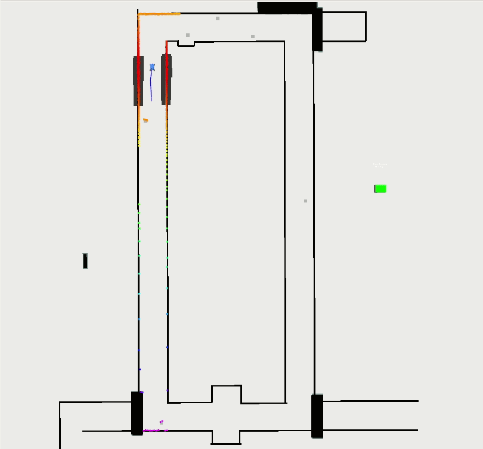

# f110_rrt_star
RRT Star path planning for dynamic obstacle avoidance for the F110 Autonomous Car

rrt_node provides a rrt star local planning method to navigate at high speeds in cluttered environments with dynamic obstacles.

This roscpp node has been tested on the f110 racecar platform at University of Pennsylvania's mLab. To test in a simulated environment, the racecar simulator can be cloned from mLab's racecar_simulator repository and run using the ros launch file provided.
